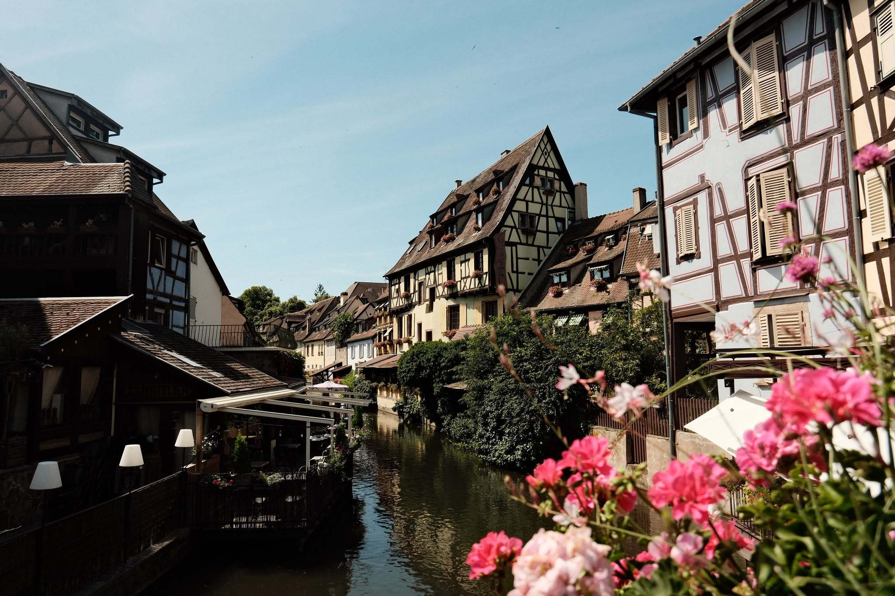
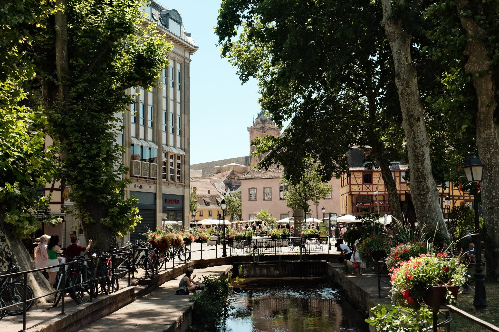
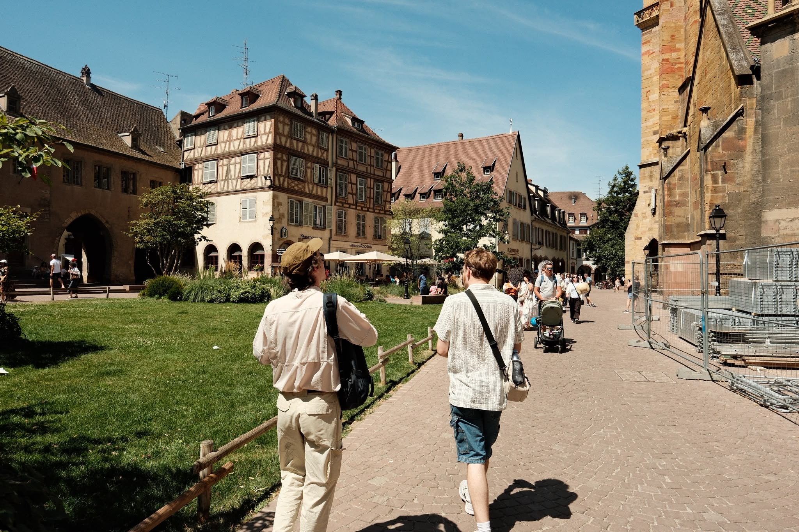
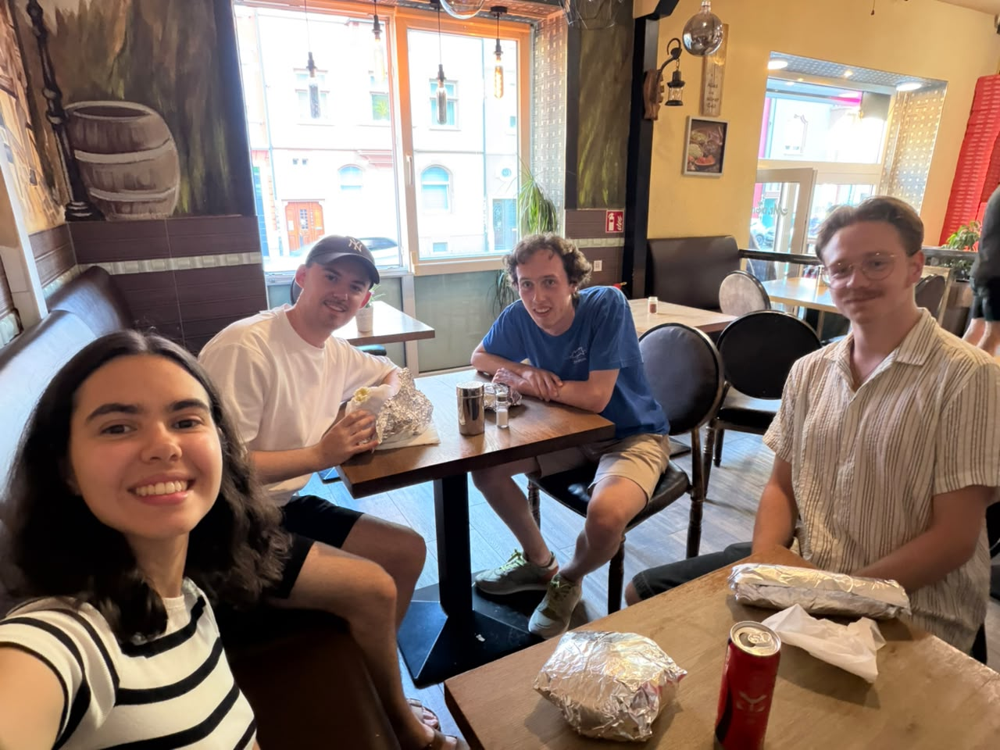

Jack Manning ist so freundlich gewesen, uns (das heisst, Jack und mich) einzuladen vor einem Besuch des franzosischen Stadt Colmar.
Mit wenige Übertreibung kann man sagen das Colmar wie eine Idylle aussieht.
Genau darum ist es warscheinlich so touristisch.

Es ist eine kleine Stadt, wo man Gebäude von verschiedenen Jahrhunderten beobachten kan.
Außerdem gibt es einen überdachten Marktplatz, wo ich einen Apfel gekauft habe (1 Euro).
Ich glaube das Colmar bekand is für manche Künstler, aber besonders Bartholdi interessierte uns, weil er das Freiheitsstatue geschaffen hat.
Auch bekannt, is das _kleine Venedig_.

Am Abend ist dann _Döner Sunday_ geboren.
Weil Jack (Manning, er kommt aus Australien) in seinem Heimatland nicht viel möglichkeiten hat, Döner zu essen, möchte er sonst wo gerne Döner essen. 
Deshalb haben wir abends in der Nähe von dem Gästehaus Döner gegessen.

