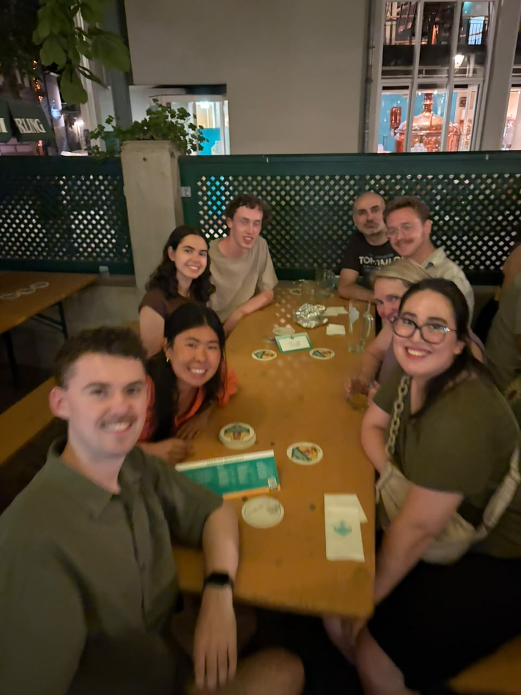

Du ratest es nie: heute ist es mein ... Geburtstag.
Am morgen machte ich die Spaziergang auf dem Schlossberg mit.
Auf dem Berg statt einen Turm, von dem man die ganze Stadt beobachten kann.

Danach bin ich mit Catherina ein Kuchen kaufen gegangen. 
Das war gar kein einfacher Aufgabe. 
Nachdem wir verschiedene Geschäfte besucht hatten, und deswegen viel gestapft, habe ich die Entscheidung getroffen, ein Himbeerenkuchen von Gmeiner zu kaufen.
Während des Pauzes des Unterrichts essten wir alle (das heisst: 16 Studenten + 1 Lehrer von dem Kuchen).
Man hat es bewertet.

Am abend bin ich mit allen, die Lust drauf hatten, ins Biergarten gegangen (Schauerling, ein Biergarten in der Stadmitte in der Nähe von dem Augustinermuseum).
Am ende, Georg von Georgiën hat traktiert und hat alles bezahlt (!).
Er hat sogar ein großes Tipp gegeben an dem Ober.

