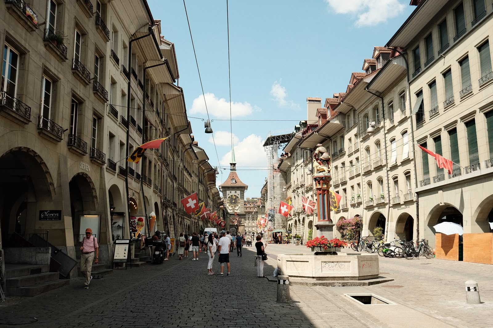
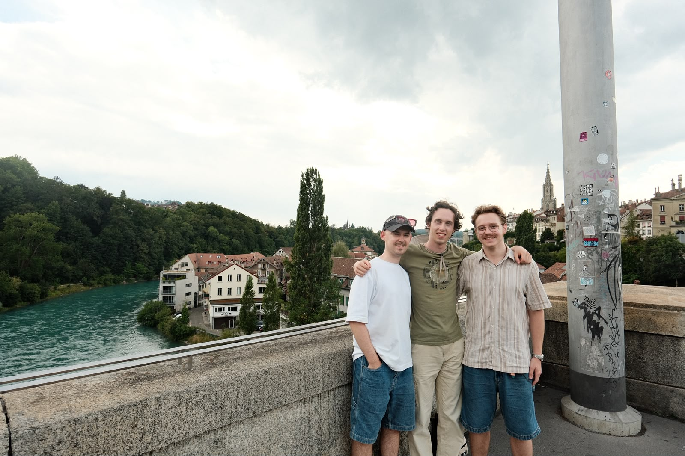

Die lang erwartete Ausflug nach Bern findet heute statt.
Wir fahren mit einem Bus ab, warscheinlich um die berüchtigte Deutsche Bahn zu meiden.
Einmal angekommen, machen wir eine kleine Stadtführung von umso 1 Stunde.
Danach gibt es Freizeit.
Zusammen mit Jack Manning, Jack Springman, Anatoli und später auch Q, besuchen wir:
- die Kathedrale, 
- die botanische Garten, 
- das Einsteinhaus (nur kurz rungucken), 

und spazieren wir ein bisschen.
Dorst hat man nicht in Bern, weil die offentliche Quellen trinkbar sein.

(links: Jack Manning, mitte: PJ, rechts: Jack Springman)

(vielen Dank an Jack Manning für die Bilder)

