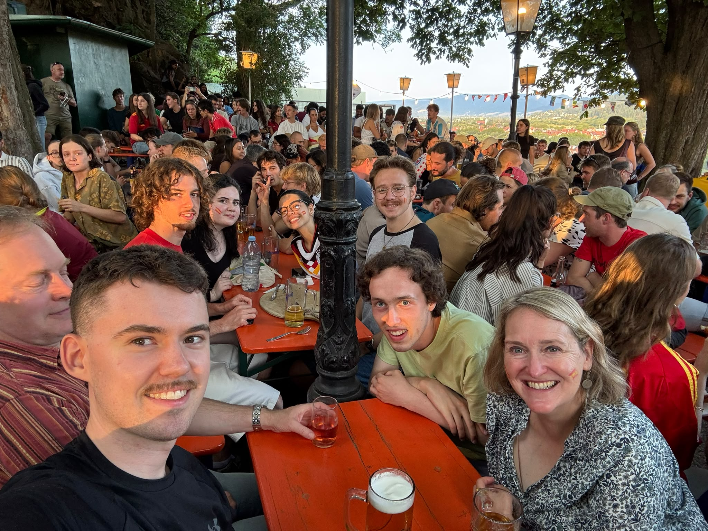

Sontag Rustdag. 
Heute passiert etwas ganz ungewohnt.
Der Olaf Dallmeier ist in Freiburg, und wir treffen uns am Mittag!
(Er ist hier seit Freitag, um sein Bruder zu besuchen.
Die lustige Tatsache ist also, dass ich am Samstag nach von Freiburg nach Bern gefahren bin, und Olaf van Bern nach Freiburg.)

Der Tag fängt an mit ein klein Jogging ins Seepark.
Weil ich mein Route nicht gut vorbereitet hat, und nur 'ungefehr' die Richtung wusste, habe ich ein bisschen mehr gelaufen als nötig.
Trotzdem habe ich das Seepark am morgen sehr geschätzt.

Jetzt ist es Zeit für die zweite Herausforderung des Tages: etwas kochen für meinen Gast.
Ich habe mich entschieden einen 'Amerikanischer' Salat zu machen, mit Nüssen, Fetakäse  Moosbeeren und süßes Obst, sowie Mango oder Aprikosen.
Weil es Sontag ist, und allein ein Edeka am Bahnhof geoffnet ist, kann ich die Zutaten nur dort kaufen. 
Schade Schokolade!
Ich habe mein Bestes getan, und das Resultat war mindestens 'essbar' ...
Zusammen mit Olaf habe ich dan nach unserem Mittagessen ein Eis gegessen in der Altstadt.

Das ist noch nicht alles. 
Am abend gibt es die Finale von der WM fußball.
Die habe ich zusammen mit viel anderen Studenten des Insituts angeschaut in dem mittlerweile bekannten Biergarten 'Kastaniengarten'.

